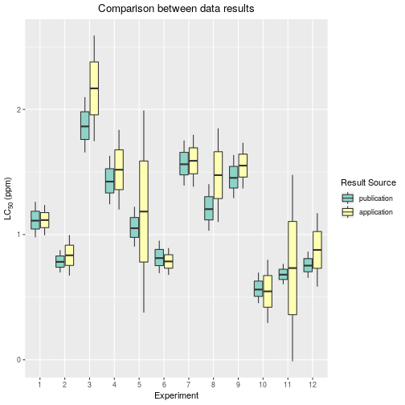

---
output:
  pdf_document: default
  html_document: default
---


# Hydrostatic pressure and temperature affect the tolerance of the free-living marine nematode <em>Halomonhystera disjuncta</em> to acute copper exposure


###                    Mevenkamp, L., Brown, A., Hauton, C., Kordas, A., Thatje, S., & Vanreusel, A. (2017). 192, 178-183.

####                    The dose response curves were calculated using the log-normal function (LN.2) model from the R statistical package <em>drc</em>. These are the results published in the manuscript:


The Shapiro test results:

```
## 
## 	Shapiro-Wilk normality test
## 
## data:  dati.1$ab[location == "publication"]
## W = 0.94878, p-value = 0.6192
```
This result indicates 

The Levene test results:

```
## Levene's Test for Homogeneity of Variance (center = mean)
##       Df F value Pr(>F)
## group  1   0.326 0.5738
##       22
```
This test result indicates 

The anova analysis results between the published data and this application's calculation:

```
##             Df Sum Sq Mean Sq F value Pr(>F)
## location     1  0.053 0.05252   0.271  0.608
## Residuals   22  4.262 0.19375
```
The anova result indicates no significant difference between the published data and the application's calculation


```
##   Tukey multiple comparisons of means
##     95% family-wise confidence level
## 
## Fit: aov(formula = results.lm)
## 
## $location
##                                diff        lwr       upr     p adj
## publication-application -0.09355833 -0.4662285 0.2791118 0.6078163
```




#### Effects of exposure to high concentrations of waterborne Tl on K and Tl concentrations in <i>Chironomus riparius</i> larvae

Belowitz, R., Leonard, E. M., & O'Donnell, M. J. (2014). Effects of exposure to high concentrations of waterborne Tl on K and Tl concentrations in Chironomus riparius larvae. Comparative Biochemistry and Physiology Part C: Toxicology & Pharmacology, 166, 59-64.

This example compares the published data from the cited article to results of this web application using the same raw data. 

##### The Shapiro test using the data from the publication:

```
## 
## 	Shapiro-Wilk normality test
## 
## data:  dati.1$ab[location == "publication"]
## W = 0.94878, p-value = 0.6192
```
##### The result of the Shapiro test with p values greater than 0.05 assume the both sets of data come from normal distribution.

##### The Levene test results:

##### The Levene's test result of a p-value greater than 0.05 indicates that the variances for both sets of data are not different.

##### The ANOVA analysis:

##### The ANOVA analysis shows that both data sets have statiscally equal means.

##### The Tukey HSD analysis:

##### The Tukey HSD analysis indicates that no significant differences exist between the means of the publication results and the web application  results. 


